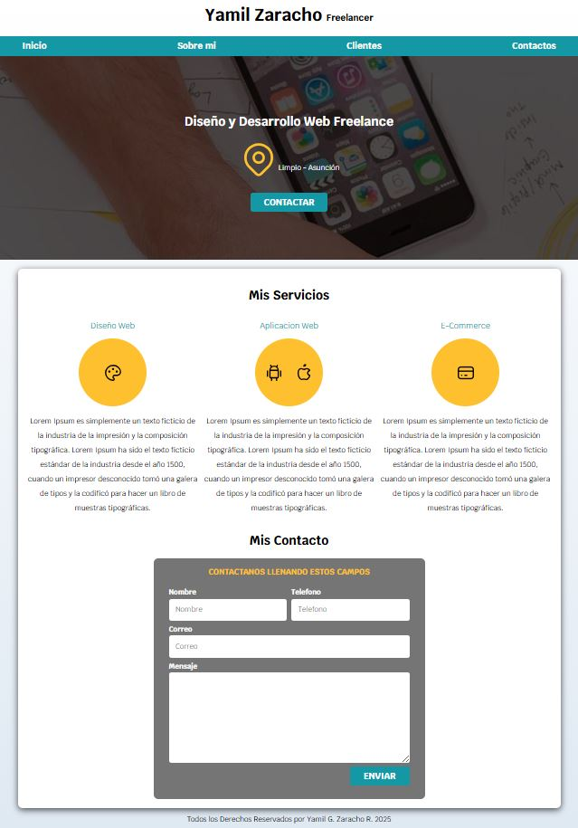

# Proyecto Freelancer

Este proyecto es una landing page profesional diseñada para freelancers que desean mostrar sus servicios, portafolio e información de contacto de forma moderna y atractiva.

## 🚀 Tecnologías utilizadas

- HTML5
- CSS3
- Diseño responsivo
- Imágenes optimizadas

## 📁 Estructura del proyecto

proyecto1_Freelancer/ ├── index.html ├── css/ │ ├── normalize.css │ └── styles.css ├── img/ │ └── hero.jpg

## 🧩 Funcionalidades

- Diseño limpio y profesional
- Layout responsivo adaptable a diferentes dispositivos
- Secciones para presentación personal, servicios y contacto

## 📷 Captura de pantalla

### Página de inicio


## 🛠️ Cómo usar

1. Clona este repositorio:
   ```bash
   git clone https://github.com/YamilGZ/proyecto-freelancer.git
   Abre index.html en tu navegador web.

## 💡 Autor
Desarrollado por Yamil G. Zaracho R. (YamilGZ).